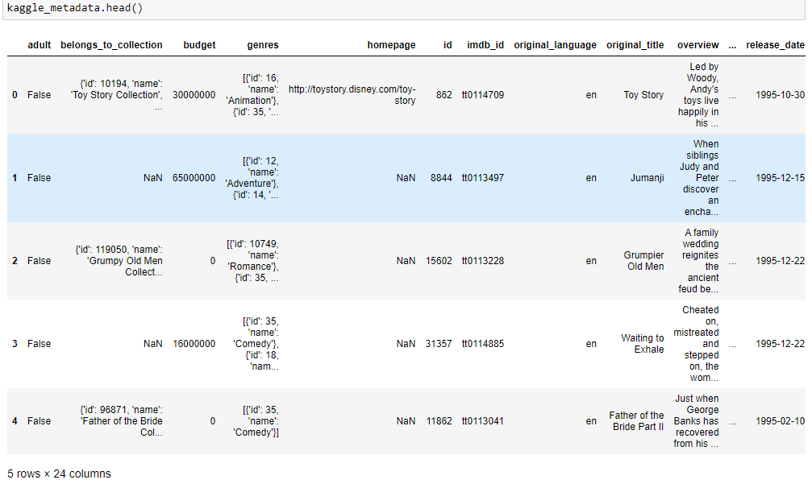
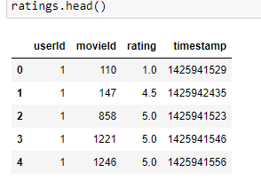
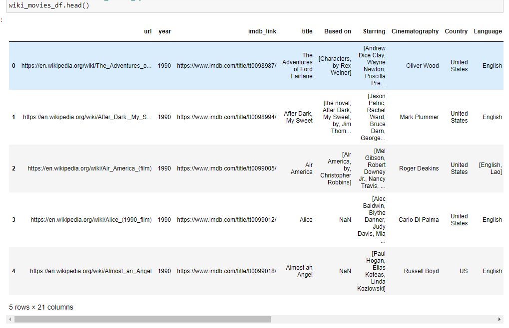
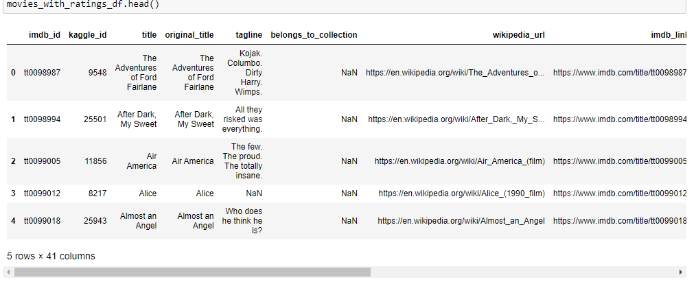
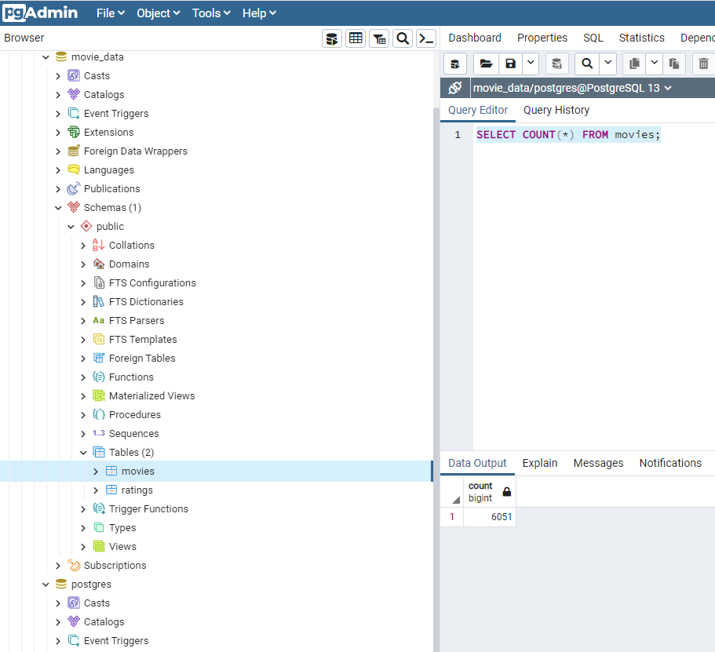

# Movies-ETL

## Overview of the analysis

This analysis is created to provide Amazing Prime necessary data to develop an algorithm to predict which low-budget movies being released or become popular so that they can buy the streaming rights at a bargain. 

We will need to create one function that takes in the three files—Wikipedia data, Kaggle metadata, and the MovieLens rating data—and performs the ETL process by adding the data to a PostgreSQL database using the following process to accomplish the goal:

- The "process_ETL" function to run through the data pipeline from extraction, transformation, and loading.
- Wikipedia-movies.json, movies_metadata.csv, and ratings.csv.
- perform the transformation steps, which include cleaning data from both Wikipedia and Kaggle.
- Wikipedia and Kaggle Movies datasets are merged into one dataset.
- The ratings dataset is kept apart.
- The newly transformed datasets are then loaded into SQL database.

## Results

1. Convert the Wikipedia JSON file to a Pandas DataFrame

   

2. Read Kaggle metadata into a DataFrame

   

3. Read ratings csv into a DataFrame

   

4. Transform wiki_movies_df

   

5. Kaggle data transformed and rating data is added

   

6. Movie Database is created

   

   

   

## Summary

Movie data is extracted, transformed and loaded into a Database and ready to be analyzed.
